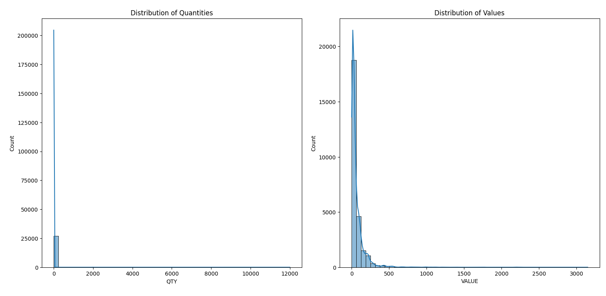
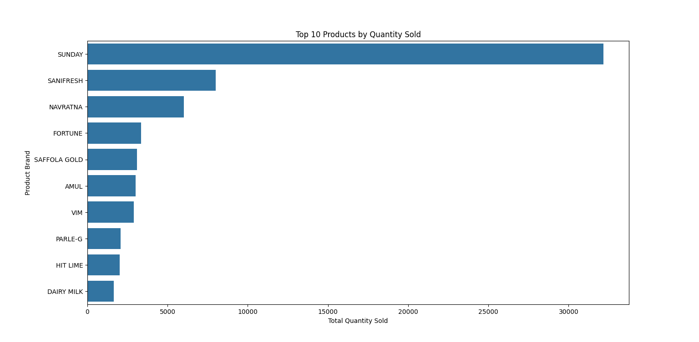

# Customer Behavior Analysis

This repository contains a data analysis project focusing on understanding and analyzing customer behavior based on transactional data. The goal is to perform Exploratory Data Analysis (EDA) to derive valuable insights into customer preferences, purchasing patterns, and overall behavior.

## Repository Contents

- `cleaned_transaction_data.csv`: The cleaned transaction data used for analysis.
- `customer_behavior_analysis.py`: The Python script for performing the EDA.
- `Figure_1.png`: Distribution of Quantities and Values.
- `Figure_2.png`: Top 10 Products by Quantity Sold.

## Analysis Overview

1. **Distribution of Quantities and Values**:
    - The first figure shows the distribution of quantities and values across transactions.
    
    

2. **Top 10 Products by Quantity Sold**:
    - The second figure highlights the top 10 products sold by quantity.
    
    

## How to Use

1. Clone the repository:
    ```bash
    git clone https://github.com/your-username/customer-behavior-analysis.git
    cd customer-behavior-analysis
    ```

2. Run the analysis script:
    ```bash
    python customer_behavior_analysis.py
    ```

## License

This project is licensed under the MIT License.
